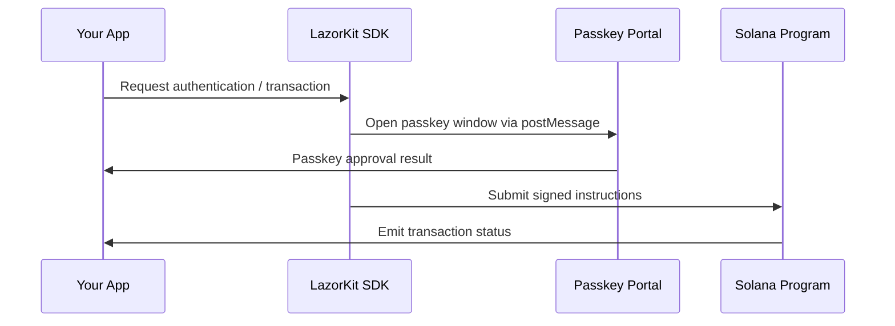

# Architecture Overview

Understand how the LazorKit project is split across multiple packages and services, and how they interact in a production deployment.

## Component Breakdown

LazorKit is delivered as a collection of focused packages that can live in separate repositories:

- **Web SDK (`@lazorkit/wallet`)** – A React-first client SDK that exposes hooks, providers, and a smart-wallet controller for browser applications.
- **Portal Web App (`@lazorkit/portal`)** – A passkey-ready popup/iframe experience that performs WebAuthn registration, signing, and secure messaging with the SDK.
- **On-chain Program (`@lazorkit/program`)** – Anchor-based Solana program code that runs the smart wallet logic and verifies passkey signatures on-chain.
- **Documentation (`@lazorkit/docs`)** – This site, which documents how to use and operate the other packages.

## Runtime Flow

1. **Your application** invokes SDK helpers to trigger login, create wallets, or send transactions.
2. **The SDK** acts as the orchestrator, opening the portal when biometric or hardware passkeys are required and maintaining the smart-wallet session locally.
3. **The Portal** handles WebAuthn UX in an isolated surface and relays signed payloads back to the SDK.
4. **The Program** receives the signed payload and executes it on Solana, emitting events back to the SDK to update UI state.

## Repository Boundaries

When splitting LazorKit into multiple repositories, keep the contracts between packages explicit:

- The SDK consumes the Portal as a published asset (e.g., CDN build) and communicates via a versioned postMessage protocol.
- The SDK and Portal share TypeScript interface packages for message payloads and event schemas.
- The Program exposes generated IDL artifacts that are imported by the SDK for instruction builders.
- Documentation tracks the published versions of each package and links to their dedicated repositories.

Keeping these seams well documented ensures contributors can work on a single package without needing the entire workspace.
