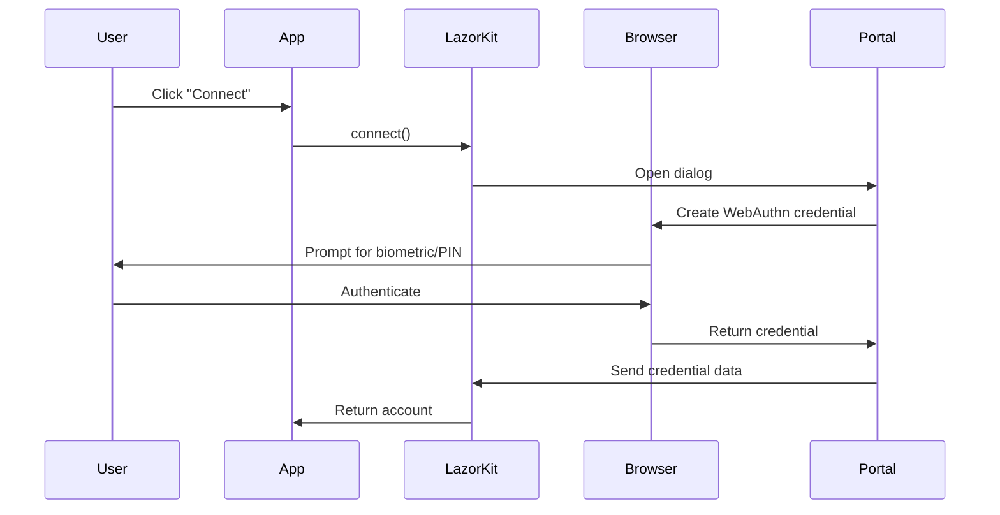
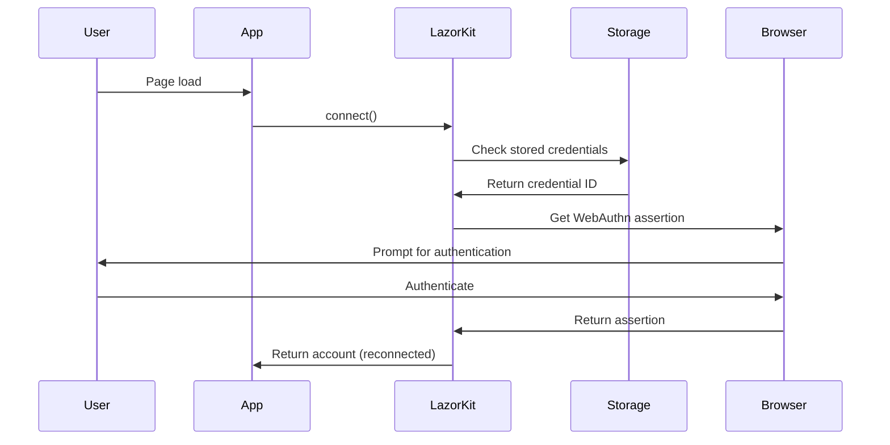

# Authentication Flow

Understanding how LazorKit handles passkey-based authentication and wallet management.

## Overview

LazorKit uses WebAuthn passkeys to provide passwordless authentication for Solana wallets. This eliminates the need for seed phrases while maintaining security and user control.

## WebAuthn Integration

### What are Passkeys?

Passkeys are a passwordless authentication standard that uses:
- **Biometric authentication** (fingerprint, face recognition)
- **Hardware security keys** (YubiKey, etc.)
- **Device authentication** (PIN, pattern)

### Browser Support

WebAuthn is supported by all modern browsers:
- Chrome 67+
- Firefox 60+
- Safari 14+
- Edge 18+

## Authentication Workflow

### 1. Initial Connection

When a user connects for the first time:



### 2. Reconnection Flow

When a user returns to the app:



## Implementation Details

### Credential Storage

LazorKit stores minimal information locally:

```typescript
interface StoredCredentials {
  credentialId: string;        // WebAuthn credential ID
  publicKey: string;           // Public key for verification
  smartWallet: string;         // Smart wallet address
  timestamp: number;           // Last connection time
}
```

**What's stored:**
- ✅ Credential identifiers
- ✅ Public keys
- ✅ Wallet addresses
- ❌ Private keys (never stored)
- ❌ Sensitive authentication data

### Security Model

1. **Private keys** are generated and stored in the browser's secure hardware
2. **Authentication** requires user interaction (biometric/PIN)
3. **Cross-origin protection** prevents unauthorized access
4. **Hardware isolation** protects against software attacks

## Connection Methods

### Standard Connection

The recommended approach that handles both new and returning users:

```tsx
import { useWallet } from '@lazorkit/wallet';

function ConnectButton() {
  const { connect, isConnecting } = useWallet();

  const handleConnect = async () => {
    try {
      // Automatically tries reconnection first, falls back to new connection
      const account = await connect();
      console.log('Connected:', account.smartWallet);
    } catch (error) {
      console.error('Connection failed:', error);
    }
  };

  return (
    <button onClick={handleConnect} disabled={isConnecting}>
      {isConnecting ? 'Connecting...' : 'Connect Wallet'}
    </button>
  );
}
```

### Manual Reconnection

For apps that want explicit control over reconnection:

```tsx
function ManualReconnect() {
  const { reconnect, connect } = useWallet();
  const [hasStoredCredentials, setHasStoredCredentials] = useState(false);

  useEffect(() => {
    // Check if user has stored credentials
    const checkCredentials = async () => {
      try {
        await reconnect();
        setHasStoredCredentials(true);
      } catch (error) {
        if (error.code === 'NO_STORED_CREDENTIALS') {
          setHasStoredCredentials(false);
        }
      }
    };
    
    checkCredentials();
  }, []);

  return (
    <div>
      {hasStoredCredentials ? (
        <button onClick={reconnect}>Reconnect</button>
      ) : (
        <button onClick={connect}>Create New Wallet</button>
      )}
    </div>
  );
}
```

### Separated Creation Flow

For custom onboarding experiences:

```tsx
function OnboardingFlow() {
  const { createPasskeyOnly, createSmartWalletOnly } = useWallet();
  const [step, setStep] = useState<'passkey' | 'wallet' | 'complete'>('passkey');
  const [passkeyData, setPasskeyData] = useState(null);

  const handleCreatePasskey = async () => {
    try {
      const data = await createPasskeyOnly();
      setPasskeyData(data);
      setStep('wallet');
    } catch (error) {
      console.error('Passkey creation failed:', error);
    }
  };

  const handleCreateWallet = async () => {
    try {
      const { account } = await createSmartWalletOnly(passkeyData);
      console.log('Wallet created:', account.smartWallet);
      setStep('complete');
    } catch (error) {
      console.error('Wallet creation failed:', error);
    }
  };

  switch (step) {
    case 'passkey':
      return <button onClick={handleCreatePasskey}>Create Passkey</button>;
    case 'wallet':
      return <button onClick={handleCreateWallet}>Deploy Wallet</button>;
    case 'complete':
      return <div>Wallet ready!</div>;
  }
}
```

## Authentication Events

LazorKit emits detailed events throughout the authentication process:

### Connection Events

```tsx
// Listen to connection events if using SDK directly
sdk.on('connect:start', () => {
  console.log('Starting connection process...');
});

sdk.on('connect:success', (account) => {
  console.log('Connected successfully:', account);
});

sdk.on('connect:error', (error) => {
  console.error('Connection failed:', error);
});
```

### Passkey Events

```tsx
sdk.on('passkey:start', () => {
  console.log('Creating passkey...');
});

sdk.on('passkey:success', (data) => {
  console.log('Passkey created:', data.credentialId);
});

sdk.on('passkey:error', (error) => {
  console.error('Passkey creation failed:', error);
});
```

### Reconnection Events

```tsx
sdk.on('reconnect:start', () => {
  console.log('Attempting reconnection...');
});

sdk.on('reconnect:success', (account) => {
  console.log('Reconnected successfully:', account);
});

sdk.on('reconnect:error', (error) => {
  if (error.code === 'NO_STORED_CREDENTIALS') {
    console.log('No stored credentials found');
  } else {
    console.error('Reconnection failed:', error);
  }
});
```

## Error Handling

### Common Authentication Errors

```tsx
function handleAuthError(error: any) {
  switch (error.code) {
    case 'NO_STORED_CREDENTIALS':
      return 'No saved credentials found. Please create a new wallet.';
    
    case 'INVALID_CREDENTIALS':
      return 'Stored credentials are invalid. Please reconnect.';
    
    case 'PASSKEY_CREATION_FAILED':
      return 'Failed to create passkey. Please check your browser settings.';
    
    case 'USER_CANCELLED':
      return 'Authentication cancelled by user.';
    
    case 'BROWSER_NOT_SUPPORTED':
      return 'Your browser does not support WebAuthn passkeys.';
    
    default:
      return 'Authentication failed. Please try again.';
  }
}
```

### User Experience Patterns

```tsx
function AuthenticationUI() {
  const { connect, isConnecting, error } = useWallet();
  const [authError, setAuthError] = useState<string | null>(null);

  const handleConnect = async () => {
    setAuthError(null);
    
    try {
      await connect();
    } catch (error) {
      const message = handleAuthError(error);
      setAuthError(message);
    }
  };

  return (
    <div>
      <button 
        onClick={handleConnect} 
        disabled={isConnecting}
        className="bg-blue-500 text-white px-4 py-2 rounded disabled:bg-gray-400"
      >
        {isConnecting ? (
          <span className="flex items-center">
            <Spinner className="mr-2" />
            Authenticating...
          </span>
        ) : (
          'Connect with Passkey'
        )}
      </button>

      {authError && (
        <div className="mt-2 p-3 bg-red-100 border border-red-400 text-red-700 rounded">
          {authError}
        </div>
      )}

      {error && (
        <div className="mt-2 text-sm text-red-600">
          {error.message}
        </div>
      )}
    </div>
  );
}
```

## Security Considerations

### Cross-Origin Protection

LazorKit validates origins to prevent attacks:

```typescript
// Origins are validated before processing messages
const allowedOrigins = [
  'https://portal.lazor.sh',
  'https://your-app.com'
];

function validateOrigin(origin: string): boolean {
  return allowedOrigins.includes(origin);
}
```

### Credential Validation

All credentials are validated before use:

```typescript
interface CredentialValidation {
  isValidFormat: boolean;      // Proper credential format
  isNotExpired: boolean;       // Within validity period
  matchesOrigin: boolean;      // Created for this origin
  hasValidSignature: boolean;  // Cryptographically valid
}
```

### Best Practices

1. **Always use HTTPS** - Required for WebAuthn
2. **Validate user gestures** - Don't auto-trigger auth prompts
3. **Handle errors gracefully** - Provide clear feedback
4. **Test across browsers** - WebAuthn behavior varies
5. **Implement timeouts** - Don't hang on failed auth

## Browser Compatibility

### Feature Detection

```typescript
function supportsWebAuthn(): boolean {
  return !!(navigator.credentials && navigator.credentials.create);
}

function CompatibilityCheck() {
  const [isSupported, setIsSupported] = useState(true);

  useEffect(() => {
    setIsSupported(supportsWebAuthn());
  }, []);

  if (!isSupported) {
    return (
      <div className="p-4 bg-yellow-100 border border-yellow-400 rounded">
        <p className="text-yellow-800">
          Your browser doesn't support passkeys. Please use a modern browser.
        </p>
      </div>
    );
  }

  return <WalletConnection />;
}
```

### Platform-Specific Considerations

- **iOS Safari**: Requires iOS 16+ for passkey support
- **Android Chrome**: Works with Android 9+ and screen lock
- **Desktop**: Hardware security keys work across all platforms
- **Incognito/Private**: Limited passkey functionality
