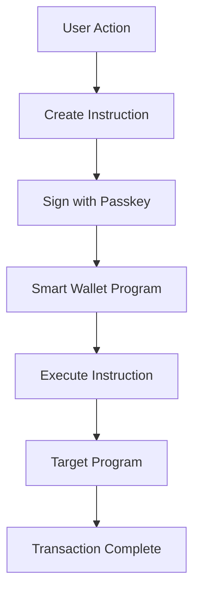

# Transaction Handling

Comprehensive guide to handling Solana transactions with LazorKit's smart wallet system.

## Transaction Flow

### Smart Wallet Architecture

LazorKit uses smart wallets that act as proxies for transaction execution:



### Transaction Types

LazorKit supports two transaction patterns:

1. **Sign and Send** (Recommended) - Complete transaction handling
2. **Sign Only** - Manual transaction management

## Basic Transaction Handling

### Sign and Send Pattern

The recommended approach for most use cases:

```tsx
import { useWallet } from '@lazorkit/wallet';
import { SystemProgram, LAMPORTS_PER_SOL, PublicKey } from '@solana/web3.js';

function TransferComponent() {
  const { signAndSendTransaction, smartWalletPubkey, isSigning } = useWallet();

  const handleTransfer = async () => {
    if (!smartWalletPubkey) return;

    try {
      const instruction = SystemProgram.transfer({
        fromPubkey: smartWalletPubkey,
        toPubkey: new PublicKey('7BeWr6tVa1pYgrEddekYTnQENU22bBw9H8HYJUkbrN71'),
        lamports: LAMPORTS_PER_SOL * 0.1, // 0.1 SOL
      });

      const signature = await signAndSendTransaction(instruction);
      console.log('Transaction sent:', signature);
      
      // Transaction is automatically sent and confirmed
    } catch (error) {
      console.error('Transaction failed:', error);
    }
  };

  return (
    <button onClick={handleTransfer} disabled={isSigning}>
      {isSigning ? 'Sending...' : 'Transfer 0.1 SOL'}
    </button>
  );
}
```

### Sign Only Pattern

For custom transaction handling:

```tsx
function CustomTransactionFlow() {
  const { signTransaction, smartWalletPubkey } = useWallet();
  const [signedTransaction, setSignedTransaction] = useState(null);

  const handleSign = async () => {
    if (!smartWalletPubkey) return;

    try {
      const instruction = SystemProgram.transfer({
        fromPubkey: smartWalletPubkey,
        toPubkey: new PublicKey('...'),
        lamports: LAMPORTS_PER_SOL * 0.1,
      });

      const signed = await signTransaction(instruction);
      setSignedTransaction(signed);
      
      // You can now send this transaction manually
      // const connection = new Connection('...');
      // const signature = await connection.sendTransaction(signed);
      
    } catch (error) {
      console.error('Signing failed:', error);
    }
  };

  return (
    <div>
      <button onClick={handleSign}>Sign Transaction</button>
      {signedTransaction && (
        <p>Transaction signed, ready to send</p>
      )}
    </div>
  );
}
```

## Advanced Transaction Patterns

### Multiple Instructions

Combine multiple instructions in a single transaction:

```tsx
function ComplexTransaction() {
  const { signAndSendTransaction, smartWalletPubkey } = useWallet();

  const handleComplexTransaction = async () => {
    if (!smartWalletPubkey) return;

    try {
      // Create multiple instructions
      const instructions = [
        // Transfer SOL
        SystemProgram.transfer({
          fromPubkey: smartWalletPubkey,
          toPubkey: new PublicKey('...'),
          lamports: LAMPORTS_PER_SOL * 0.1,
        }),
        
        // Create account (example)
        SystemProgram.createAccount({
          fromPubkey: smartWalletPubkey,
          newAccountPubkey: new PublicKey('...'),
          lamports: LAMPORTS_PER_SOL * 0.001,
          space: 0,
          programId: SystemProgram.programId,
        }),
      ];

      // Note: Currently signAndSendTransaction accepts single instruction
      // For multiple instructions, use the transaction builder pattern
      for (const instruction of instructions) {
        await signAndSendTransaction(instruction);
      }

    } catch (error) {
      console.error('Complex transaction failed:', error);
    }
  };

  return (
    <button onClick={handleComplexTransaction}>
      Execute Complex Transaction
    </button>
  );
}
```

### Transaction with Custom Hook

Create reusable transaction logic:

```tsx
// hooks/useTransactionSender.ts
import { useCallback, useState } from 'react';
import { useWallet } from '@lazorkit/wallet';
import { TransactionInstruction } from '@solana/web3.js';

interface TransactionState {
  isLoading: boolean;
  signature: string | null;
  error: string | null;
}

export function useTransactionSender() {
  const { signAndSendTransaction, isConnected } = useWallet();
  const [state, setState] = useState<TransactionState>({
    isLoading: false,
    signature: null,
    error: null,
  });

  const sendTransaction = useCallback(async (instruction: TransactionInstruction) => {
    if (!isConnected) {
      throw new Error('Wallet not connected');
    }

    setState({ isLoading: true, signature: null, error: null });

    try {
      const signature = await signAndSendTransaction(instruction);
      setState({ isLoading: false, signature, error: null });
      return signature;
    } catch (error) {
      const errorMessage = error instanceof Error ? error.message : 'Transaction failed';
      setState({ isLoading: false, signature: null, error: errorMessage });
      throw error;
    }
  }, [signAndSendTransaction, isConnected]);

  const reset = useCallback(() => {
    setState({ isLoading: false, signature: null, error: null });
  }, []);

  return {
    sendTransaction,
    reset,
    ...state,
  };
}

// Usage
function TransactionComponent() {
  const { sendTransaction, isLoading, signature, error, reset } = useTransactionSender();
  const { smartWalletPubkey } = useWallet();

  const handleSend = async () => {
    if (!smartWalletPubkey) return;

    const instruction = SystemProgram.transfer({
      fromPubkey: smartWalletPubkey,
      toPubkey: new PublicKey('...'),
      lamports: LAMPORTS_PER_SOL * 0.1,
    });

    try {
      await sendTransaction(instruction);
    } catch (error) {
      // Error already handled by hook
    }
  };

  return (
    <div>
      <button onClick={handleSend} disabled={isLoading}>
        {isLoading ? 'Sending...' : 'Send Transaction'}
      </button>
      
      {signature && (
        <div className="mt-2 p-2 bg-green-100 border border-green-400 rounded">
          <p className="text-green-700">
            Transaction sent: {signature.slice(0, 8)}...
          </p>
        </div>
      )}
      
      {error && (
        <div className="mt-2 p-2 bg-red-100 border border-red-400 rounded">
          <p className="text-red-700">{error}</p>
          <button onClick={reset} className="mt-1 text-sm underline">
            Try Again
          </button>
        </div>
      )}
    </div>
  );
}
```

## Program Interactions

### SPL Token Transfers

Example of transferring SPL tokens:

```tsx
import { createTransferInstruction, getAssociatedTokenAddress } from '@solana/spl-token';

function TokenTransfer() {
  const { signAndSendTransaction, smartWalletPubkey } = useWallet();
  
  const handleTokenTransfer = async () => {
    if (!smartWalletPubkey) return;

    try {
      const mintAddress = new PublicKey('So11111111111111111111111111111111111111112'); // WSOL
      const recipientAddress = new PublicKey('...');
      
      // Get associated token addresses
      const senderTokenAccount = await getAssociatedTokenAddress(
        mintAddress,
        smartWalletPubkey
      );
      
      const recipientTokenAccount = await getAssociatedTokenAddress(
        mintAddress,
        recipientAddress
      );

      // Create transfer instruction
      const instruction = createTransferInstruction(
        senderTokenAccount,
        recipientTokenAccount,
        smartWalletPubkey,
        1000000, // Amount in token decimals
      );

      const signature = await signAndSendTransaction(instruction);
      console.log('Token transfer sent:', signature);
      
    } catch (error) {
      console.error('Token transfer failed:', error);
    }
  };

  return (
    <button onClick={handleTokenTransfer}>
      Transfer Tokens
    </button>
  );
}
```

### Custom Program Calls

Interacting with custom Solana programs:

```tsx
import { PublicKey, TransactionInstruction } from '@solana/web3.js';

function CustomProgramCall() {
  const { signAndSendTransaction, smartWalletPubkey } = useWallet();

  const handleProgramCall = async () => {
    if (!smartWalletPubkey) return;

    try {
      const programId = new PublicKey('YourProgramId...');
      
      // Create custom instruction
      const instruction = new TransactionInstruction({
        keys: [
          { pubkey: smartWalletPubkey, isSigner: true, isWritable: true },
          { pubkey: new PublicKey('...'), isSigner: false, isWritable: false },
        ],
        programId,
        data: Buffer.from([1, 2, 3]), // Your instruction data
      });

      const signature = await signAndSendTransaction(instruction);
      console.log('Program call sent:', signature);
      
    } catch (error) {
      console.error('Program call failed:', error);
    }
  };

  return (
    <button onClick={handleProgramCall}>
      Call Custom Program
    </button>
  );
}
```

## Transaction Monitoring

### Real-time Status Updates

Monitor transaction status with events:

```tsx
function TransactionMonitor() {
  const [transactions, setTransactions] = useState<Array<{
    signature: string;
    status: 'pending' | 'confirmed' | 'failed';
    timestamp: number;
  }>>([]);

  const { signAndSendTransaction } = useWallet();

  const handleTransaction = async (instruction: TransactionInstruction) => {
    try {
      const signature = await signAndSendTransaction(instruction);
      
      // Add to monitoring list
      setTransactions(prev => [...prev, {
        signature,
        status: 'pending',
        timestamp: Date.now(),
      }]);

      // Monitor confirmation
      monitorTransaction(signature);
      
    } catch (error) {
      console.error('Transaction failed:', error);
    }
  };

  const monitorTransaction = async (signature: string) => {
    // Note: You'd implement actual confirmation checking here
    // This is a simplified example
    setTimeout(() => {
      setTransactions(prev => 
        prev.map(tx => 
          tx.signature === signature 
            ? { ...tx, status: 'confirmed' }
            : tx
        )
      );
    }, 5000);
  };

  return (
    <div>
      <h3>Transaction History</h3>
      {transactions.map(tx => (
        <div key={tx.signature} className="p-2 border rounded mb-2">
          <p className="font-mono text-sm">
            {tx.signature.slice(0, 8)}...
          </p>
          <p className={`text-sm ${
            tx.status === 'confirmed' ? 'text-green-600' : 
            tx.status === 'failed' ? 'text-red-600' : 'text-yellow-600'
          }`}>
            {tx.status}
          </p>
        </div>
      ))}
    </div>
  );
}
```

## Error Handling

### Transaction Error Types

```tsx
function handleTransactionError(error: any) {
  switch (error.code) {
    case 'TRANSACTION_FAILED':
      return 'Transaction failed to execute. Please try again.';
    
    case 'INSUFFICIENT_FUNDS':
      return 'Insufficient balance to complete transaction.';
    
    case 'BLOCKHASH_NOT_FOUND':
      return 'Transaction expired. Please retry.';
    
    case 'USER_CANCELLED':
      return 'Transaction cancelled by user.';
    
    default:
      return `Transaction error: ${error.message}`;
  }
}
```

### Retry Logic

Implement smart retry for failed transactions:

```tsx
function useTransactionRetry() {
  const { signAndSendTransaction } = useWallet();
  const [attempts, setAttempts] = useState(0);

  const sendWithRetry = async (
    instruction: TransactionInstruction,
    maxAttempts = 3
  ) => {
    for (let attempt = 1; attempt <= maxAttempts; attempt++) {
      setAttempts(attempt);
      
      try {
        const signature = await signAndSendTransaction(instruction);
        setAttempts(0);
        return signature;
      } catch (error) {
        if (attempt === maxAttempts) {
          setAttempts(0);
          throw error;
        }
        
        // Wait before retry
        await new Promise(resolve => setTimeout(resolve, 1000 * attempt));
      }
    }
  };

  return { sendWithRetry, attempts };
}
```

## Best Practices

### 1. Transaction Validation

Always validate before sending:

```tsx
function validateTransaction(instruction: TransactionInstruction, wallet: PublicKey) {
  // Check if wallet is a signer
  const isSigner = instruction.keys.some(
    key => key.pubkey.equals(wallet) && key.isSigner
  );
  
  if (!isSigner) {
    throw new Error('Wallet must be a signer for this transaction');
  }

  // Validate instruction data
  if (!instruction.data || instruction.data.length === 0) {
    throw new Error('Transaction instruction data is required');
  }

  return true;
}
```

### 2. Gas Estimation

Check transaction costs before execution:

```tsx
async function estimateTransactionCost(instruction: TransactionInstruction) {
  // Note: This is a simplified example
  // In practice, you'd use Solana's getFeeForMessage
  const baseFee = 5000; // lamports
  const computeUnits = instruction.keys.length * 1000;
  
  return baseFee + computeUnits;
}
```

### 3. User Feedback

Provide clear transaction feedback:

```tsx
function TransactionFeedback({ status, signature }: {
  status: 'idle' | 'signing' | 'sending' | 'confirming' | 'success' | 'error';
  signature?: string;
}) {
  const messages = {
    idle: 'Ready to send transaction',
    signing: 'Please confirm with your passkey...',
    sending: 'Sending transaction to network...',
    confirming: 'Waiting for confirmation...',
    success: 'Transaction confirmed!',
    error: 'Transaction failed',
  };

  return (
    <div className={`p-3 rounded ${
      status === 'success' ? 'bg-green-100 text-green-700' :
      status === 'error' ? 'bg-red-100 text-red-700' :
      'bg-blue-100 text-blue-700'
    }`}>
      <p>{messages[status]}</p>
      {signature && (
        <p className="text-sm font-mono mt-1">
          Signature: {signature.slice(0, 8)}...
        </p>
      )}
    </div>
  );
}
```

## Gasless Transactions

LazorKit supports gasless transactions through paymaster integration:

```tsx
// Gasless transactions are automatically handled
// when a paymaster URL is configured in the provider
function GaslessTransfer() {
  const { signAndSendTransaction, smartWalletPubkey } = useWallet();

  const handleGaslessTransfer = async () => {
    if (!smartWalletPubkey) return;

    // This transaction will be sponsored by the paymaster
    const instruction = SystemProgram.transfer({
      fromPubkey: smartWalletPubkey,
      toPubkey: new PublicKey('...'),
      lamports: LAMPORTS_PER_SOL * 0.1,
    });

    try {
      // No SOL required for transaction fees
      const signature = await signAndSendTransaction(instruction);
      console.log('Gasless transaction sent:', signature);
    } catch (error) {
      console.error('Gasless transaction failed:', error);
    }
  };

  return (
    <button onClick={handleGaslessTransfer}>
      Send Gasless Transaction
    </button>
  );
}
```
